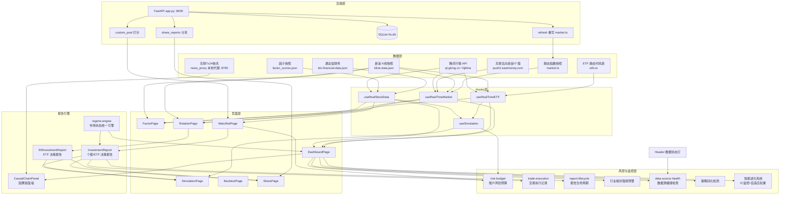
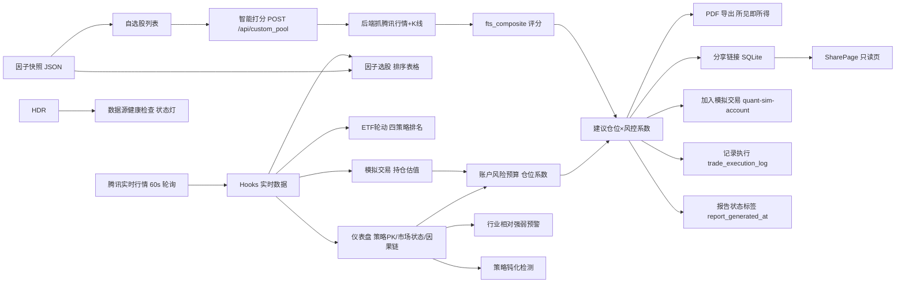

# QUANT PRO 系统工作流与数据架构说明书

> 版本：v2.9（基于 2026-08-12 最新代码状态，本次更新日期 2026-08-12）
> 审核对象：`app_17beuetfu9m (2)/`（前端 React 19 + Vite + Tailwind v4，打包产物 `dist/assets/index-B3WrOZ0j.js`）与 `app.py`（后端 FastAPI，已打包为 `QUANT_PRO_backend.exe`）
> 修订说明：本版在 v2.8 基础上增量更新：① PTrade 实盘策略文件 `ptrade_fts_top3.py` 完成 v8 优化——动态 Kelly 参数按 market_trend 切换（牛市 0.58/1.90、震荡 0.49/1.20、熊市 0.40/1.00）；② 止盈分档由 (15,0.3)(20,0.3)(30,1.0) 上调为 (20,0.3)(30,0.3)(40,1.0)；③ 移动止损执行优先级提升至部分止盈之前；④ 熊市止损阈值由 -3% 放宽至 -5%，新增"连续3日跌破MA20"备选触发；⑤ 仓位下限公式由 max(2000, total_value*0.01) 调整为 max(3000, total_value*0.005)；⑥ 日志精简（买入跳过聚合单行、回撤/买入状态仅在变化时记录）；⑦ 新增 g.t1_bought_today 集合防止当日卖出 T+1 标的；⑧ 新增 after_trading_end 月度汇总、_record_sell_stat 卖出统计、_print_summary 回测结果打印。所有结论均经源码核对确认

---

## 一、系统概览

### 1.1 功能模块全景图



### 1.2 核心数据流图



---

## 二、各模块职责与数据流向

### 2.1 仪表盘总览（`src/pages/DashboardPage/DashboardPage.tsx`）

| 项 | 说明 |
|---|---|
| 输入 | `useRealTimeMarket`（指数/情绪/行业，指数K线已预载 120 根）、`useRealStockData`（300 只实时行情+因子快照）、`useRealTimeETF`、`localStorage('quant-sim-account')` |
| 输出 | 市场状态横幅（统一引擎）、策略信号 PK（Top5 因子/ETF）、因果链面板（6 项验证）、行业卡片、数据速览、进化日志、账户风险暴露指示器、行业预警条、数据源异常警告条、策略钝化状态条、数据时间戳显示（v2.2 新增） |
| 下游依赖 | 因果链面板 → `causal-engine`；进化日志 → 模拟交易账户（key 已统一为 `quant-sim-account`）；风控指示器 → `lib/risk-budget.ts`；行业预警 → `getIndustryWeakStreaks` + 自选/持仓映射 |
| 自算逻辑 | `calcFactorScores`（6 维风格分）、`calcStrategyQualityScore`（策略质量）、`copyHoldingsToSimulation`（批量加入模拟交易）、`getStrategyDullness`（策略钝化检测）、`getIndustryWeakStreaks`（行业排名历史）、`dataTimestamps`（HEAD 读取 K线/因子快照文件 Last-Modified） |

### 2.2 因子选股（`src/pages/FactorPage/FactorPage.tsx`）

| 项 | 说明 |
|---|---|
| 输入 | `useRealStockData`、`useRealTimeMarket`、`kline-data.json`（IC 序列/五分位）、`fts-elite.ts` 权重 |
| 输出 | 因子库配置、Regime 状态（统一 `detectRegime`）、综合得分排序表、Top5 FTS、IC 序列图、Elite 回测 |
| 下游依赖 | 自选星标写 `localStorage('watchlist_stocks')`（已与自选页统一）；IC 序列图为智能进化系统提供因子有效性监控 |
| 自算逻辑 | 29 因子 min-max 归一化加权 + `frontScore*0.7 + ftsScore*0.3` 融合 |

### 2.3 ETF 轮动（`src/pages/RotationPage/RotationPage.tsx`）

| 项 | 说明 |
|---|---|
| 输入 | `useRealTimeETF`、`useRealTimeMarket`、`kline-data.json`、`fts-regime.ts` |
| 输出 | 四策略排名（momentum/relative/sharpe/fts）、过滤、调仓信号、ETF 决策报告（EtfInvestmentReport） |
| 下游依赖 | 决策报告 → 导出 PDF / 分享 / 加入模拟交易 |
| 自算逻辑 | 内联 MA/波动率/RSRS/Sharpe、`detectRegime`（5 态，真实涨跌家数） |
| 补充 | v2.8：排名表新增「距20日高点」（20日最高价基于 `t.high` 实时序列，创新高钳位 0，与20日涨跌幅一致性校验偏差>5%显示⚠️）、「买入区间」（复用决策报告 `rNe` 算法，按现价距区间上沿分档：≤0.5%接近区间 / 0.5-1%待回调 / >1%高于区间）、「综合建议」（四维决策：排名+信号+距高点+区间）；医药与跨境（标普/纳指）同现时表头显示品种分配建议卡片（弹性/稳健/兼顾配置） |

### 2.4 智能打分（`src/pages/WatchlistPage/WatchlistPage.tsx`，个股 + ETF）

| 项 | 说明 |
|---|---|
| 输入 | 用户输入代码 → `POST http://localhost:8000/api/custom_pool`（后端独立抓取腾讯行情 + K线） |
| 输出 | `fts_composite` 绝对分（0-100）、排名表、InvestmentReport 决策报告 |
| 下游依赖 | 决策报告 → 导出 PDF / 分享链接 / 加入模拟交易 / 记录执行 / 报告生命周期状态 |
| 自算逻辑 | 后端 `compute_factors`（29 因子 + FTS 5 因子）；报告内市场环境走统一引擎、占优因子实测计算 |

### 2.5 模拟交易（`src/pages/SimulationPage/SimulationPage.tsx`）

| 项 | 说明 |
|---|---|
| 输入 | `useSimulation` → `useRealTimeETF` + `useRealStockData`、`localStorage('quant-sim-account')` |
| 输出 | 持仓/净值曲线/交易记录/信号 |
| 下游依赖 | 被仪表盘进化日志消费（key 已统一，可读真实交易）；被账户风险预算消费（`dailySnapshots` 计算月度盈亏/回撤） |
| 自算逻辑 | `simulation-engine`：`executeSignals` / `updatePrices` / `manualTrade` / `calculateMetrics` / `createDemoAccount`（v2.4 新增） |
| 补充 | v2.4：首次使用（key 不存在）自动初始化演示数据；`storage`/`focus` 事件监听实现跨页面自动刷新 |
| 补充 | v2.5：`etfSignals`/`stockSignals` 独立信号源；`rebalance(target)` 选股/ETF 分开执行；交易记录按类型筛选 |
| 补充 | v2.6：`TradeRecord.type`/`note` 字段；交易记录回看（类型+时间筛选、统计摘要、标的汇总、导出CSV） |
| 补充 | v2.7：桌面版——`app.py` 支持 `REACT_DIR`/`QUANT_PRO_DB`/`QUANT_PRO_MARKET_TS` 环境变量；新增外部行情代理路由（`/api/quote`、`/api/eastmoney` 等）；PyInstaller 打包为 `QUANT_PRO_backend.exe` |

### 2.6 分享功能（`src/pages/SharePage/SharePage.tsx` + 后端 `app.py`）

| 项 | 说明 |
|---|---|
| 输入 | 报告 `collectShareData()` 平铺对象 → `POST /api/reports/share` → SQLite `share_reports` |
| 输出 | `/share/{share_id}` 只读页；7 天有效期、限流 10 个/小时 |
| 下游依赖 | SharePage 数据读取已兼容平铺/包装两种结构（P0-1 修复） |
| 补充 | 2026-08-08 已修复 Vite dev 代理：`vite.config.ts` 增加 `/api` 通配代理转发到 `localhost:8000`，dev 模式分享创建/读取链路完整可用（此前 POST `/api/reports/share` 在 dev 下返回 404） |

### 2.7 智能进化系统（IC 监控 + 自适应权重）

| 项 | 说明 |
|---|---|
| 输入 | FactorPage IC 序列图（因子有效性监控）、DashboardPage 进化日志（从 `quant-sim-account` 交易记录计算） |
| 输出 | 因子权重自适应调整（兑现率 ≥80% 权重 +2，<40% 权重 -1）；连续 3 次低兑现触发系统建议 |
| 存储 | `quant-sim-account` 交易记录驱动；`score_history_{key}`（近 7 天评分趋势） |
| 判定 | 进化日志 `fulfillmentRate`：盈利 >0 → 100，亏损 → 33；连续失败 ≥3 次 → `systemAdvice` 提示审视因果链置信度 |

### 2.8 交易执行记录（`src/lib/trade-execution.ts`）

| 项 | 说明 |
|---|---|
| 输入 | InvestmentReport「📝 记录执行」弹窗（自动填入标的/当前价/建议仓位/止损价/止盈价，可修改 + 备注） |
| 输出 | 写入 `localStorage('trade_execution_log')`；仪表盘「进化日志」上方「执行记录」折叠面板展示最近 10 条 |
| 记录格式 | `{ id: timestamp, symbol, name, price, position, stopLoss, takeProfit, note, executedAt }` |
| 容量 | 最多保留 50 条，读取默认最近 10 条 |

### 2.9 报告生命周期跟踪（`InvestmentReport.getReportStatus`）

| 项 | 说明 |
|---|---|
| 输入 | 报告生成时间（`localStorage('report_generated_at_{code}')`，首次打开报告时写入）、当前价、买入区间上限、止损价 |
| 输出 | 综合评分旁状态标签 + 失效红色横幅 |
| 状态判定 | 生成 ≥7 天 → ⚪ 已过期；当前价 > 买入上限×1.02 或 < 止损×0.98 → 🔴 已失效；生成 ≥24h → 🟡 待更新；否则 🟢 有效 |
| 触发 | 每次打开报告时实时计算；已失效时顶部显示"报告已失效，当前价格已超出建议区间，请重新打分" |

### 2.10 账户风险预算（`src/lib/risk-budget.ts`）

| 项 | 说明 |
|---|---|
| 输入 | `localStorage('quant-sim-account')` 的 `dailySnapshots`（按月份前缀过滤） |
| 输出 | 本月累计盈亏比例、本月回撤比例、仓位系数；仪表盘市场横幅右侧「账户风险暴露」指示器；报告建议仓位自动 × 系数 |
| 判定规则 | 回撤 <3% → 🟢 正常（系数 1.0）；3%-5% → 🟡 注意（系数 0.7）；>5% → 🔴 高风险（系数 0.5） |
| 报告联动 | `adjustPositionPct(basePct, budget)`，建议仓位处显示"本月已回撤 4.2%，仓位系数 0.7，建议仓位由 4% 调整为 2.8%" |

### 2.11 行业相对强弱预警（`DashboardPage.getIndustryWeakStreaks`）

| 项 | 说明 |
|---|---|
| 输入 | 行业因果卡片每日涨幅排名（`localStorage('ind_rank_history')`，date → 行业名数组按涨幅排序） |
| 输出 | 仪表盘「市场状态横幅」下方独立黄色警告条 |
| 判定规则 | 连续 3 日行业排名 > 50%（后 50%），且该行业有自选股（`watchlist_stocks`）或持仓股（`quant-sim-account`） |
| 预警文案 | "行业预警：XX行业已连续3日走弱，持仓的XX、XX可能承压" |

### 2.12 数据源健康检查（`src/lib/data-source-health.ts` + Header 数据状态灯）

| 项 | 说明 |
|---|---|
| 输入 | 腾讯行情 API（`/api/quote/sh600519` 探测）、`factor_scores.json` / `kline-data.json`（HEAD 取 Last-Modified）、后端 `/api/health` |
| 输出 | Header 右侧「数据状态」指示器（圆点状态灯：绿/黄/红），点击弹出详细面板（可刷新）；仪表盘顶部黄色警告条 |
| 判定规则 | 接口不可达 → 🔴；静态文件更新时间 >2 天 → 🟡；全部正常 → 🟢 |
| 警告文案 | "数据源异常：XX数据已延迟超过2天，报告仅供参考" |

### 2.13 策略钝化检测（`DashboardPage.getStrategyDullness`）

| 项 | 说明 |
|---|---|
| 输入 | 每日因子策略 vs ETF 轮动的当日平均涨幅对比（`localStorage('strat_daily_winner')`，date → boolean） |
| 输出 | 策略 PK 区域底部状态条 |
| 判定规则 | 近 5 日跑赢 ≤1 次 → ⚠️ 策略钝化，建议关注 ETF 轮动；跑赢 0 次 → 高亮红色警告；正常时显示"因子策略 近5日跑赢ETF轮动 X次 / 5日 → 表现正常" |

### 2.14 数据时间戳显示（`DashboardPage.dataTimestamps`，v2.2 新增）

| 项 | 说明 |
|---|---|
| 输入 | 市场横幅右侧小字：`📡 数据状态：行情 HH:MM:SS ｜ K线 MM-DD ｜ 因子快照 MM-DD` |
| 行情时间 | 取 `useRealTimeMarket.lastUpdate`（每次行情轮询成功时的时钟时间，格式 HH:MM:SS） |
| K线时间 | `fetch('/kline-data.json', {method:'HEAD'})` 读取 `Last-Modified` 响应头，格式化为 MM-DD |
| 因子时间 | `fetch('/factor_scores.json', {method:'HEAD'})` 读取 `Last-Modified` 响应头，格式化为 MM-DD |
| 未知处理 | 请求失败或响应头缺失时显示"未知" |

### 2.15 新闻事件感知层（v2.8 新增）

| 项 | 说明 |
|---|---|
| 数据源 | 东方财富 7x24 快讯公开接口（免 Token、免鉴权，需 Referer/UA 头，浏览器端受 CORS 限制故经本地代理转发） |
| 中间层 | `D:\股票仪表盘\news_proxy.mjs`（Node 零依赖，监听 :8765）：转发快讯 + 5 分钟缓存 `news_cache.json`；接口 `GET /api/news/latest`（最近快讯）、`GET /api/news/matched?q=&name=`（关键词匹配信号）；启动脚本 `D:\股票仪表盘\启动新闻服务.bat` |
| 前端接入 | `dist/assets/index-B3WrOZ0j.js` 模块级函数：`_getNewsCache`（读 localStorage `news_cache`）、`_fetchNews`（缓存过期>5 分钟拉取 :8765 并写回）、`_matchNewsForStock`（19 行业关键词库 + 利好/利空词计数判定方向） |
| 因果链集成 | `Txe` 生成 `chain.eventNews`；决策报告新增「📰 事件驱动」行：利好/利空标签（红绿）+ 新闻标题 + 推理逻辑（命中关键词 → 事件方向 → 决策方向确认「回避/关注」） |
| 降级 | 服务不可用 → "新闻数据暂未接入，因果链基于技术面数据"；关键词未命中 → "未发现关联事件，可能是技术面驱动"（实测：招商轮船大跌时快讯无航运新闻，正确显示后者） |

### 2.16 核心因果链决策方向（v2.8 修复）

| 项 | 说明 |
|---|---|
| 生成函数 | `Txe`（`dist/assets/index-B3WrOZ0j.js`）：从股票池选 \|涨跌幅\| 最大且 >2% 的异动股，否则显示"今日无显著异动" |
| 推理方向 | 修复前：仅按置信度分数分级，大跌股因子分高也会"果断介入"（果→果，错误）；修复后：事件方向优先（因→果）——大跌(≤-5%)→"回避该标的，检查持仓止损"；大涨(≥5%) + 高分(≥85) + 净事件驱动>5% →"果断介入，可适度加仓"；大涨其余 →"关注，需进一步验证驱动逻辑"；中跌/中涨(3-5%)→"谨慎/关注"；正常波动→"正常波动，无需操作" |
| 归因拆解 | `vxe`：个股涨跌 = 大盘贡献×0.7 + 行业贡献×0.3 + 随机波动 0.5% + 净事件驱动残差；\|残差\|>5% → 强事件驱动，因果链成立 |
| 六维验证 | 多因子共振 / 干扰因子排除（归因）/ 多时间尺度 / 负向因果检查 / 宏观归因 / 同类历史回测 |
| 置信度 | 基础 30% + 各模块加权（多因子 0.2 / 干扰 0.15 / 多时间 0.1 / 负向 0.1 / 宏观 0.1 / 历史 0.05），封顶 100 |
| 因果衰减 | `Cxe`：事件效力按类型指数衰减（政策/数据/消息/结构驱动，半衰期不同），剩余效力 = 初始 × e^(-λt) |

---

## 三、数据一致性检查

### 3.1 关键数据项口径对比（最新状态）

| 数据项 | 仪表盘 | 因子选股 | 智能打分 | ETF轮动 | 状态 |
|---|---|---|---|---|---|
| FTS 权重 | `fts-weights.ts` 单一数据源：lowvol 0.20 / xsmom 0.25 / trend 0.20 / vpcorr 0.20 / bias 0.15 | 同左 | 同左（app.py 已对齐） | 同左 | **已统一** |
| 市场状态 | `regime-engine.detectMarketRegime`（3 态展示） | `detectRegime`（5 态） | 统一引擎（3 态展示） | `detectRegime`（5 态） | **已统一**（同源，展示态不同） |
| 占优因子 | 6 维聚合分最高者 | regime 建议权重 | 实测六因子最高分 | 不适用 | **已修复**（打分不再硬编码） |
| 模拟交易账户 | `quant-sim-account` | 不适用 | 写 `quant-sim-account` | 写 `quant-sim-account` | **已统一** |
| 自选股 | `watchlist_stocks` | `watchlist_stocks` | `watchlist_stocks` | 不适用 | **已统一** |
| 交易执行记录 | `trade_execution_log`（新） | 不适用 | 写 `trade_execution_log` | 写 `trade_execution_log` | **已统一**（唯一 key） |
| 报告生命周期 | 不适用 | 不适用 | `report_generated_at_{code}` | 同左 | **新增**（唯一 key） |
| 行业排名历史 | `ind_rank_history`（新） | 不适用 | 不适用 | 不适用 | **新增** |
| 策略日胜记录 | `strat_daily_winner`（新） | 不适用 | 不适用 | 不适用 | **新增** |
| 指数K线 | kline-data.json 预载 120 根 + 实时覆盖 | kline-data.json | 静态 MARKET_INDICES | kline-data.json | **部分修复**（打分仍用静态快照） |
| 数据时间戳 | `Last-Modified` 响应头（v2.2 新增） | 不适用 | 不适用 | 不适用 | **新增**（统一 HEAD 读取） |

### 3.2 已修复问题记录

| 编号 | 问题 | 修复方式 | 状态 |
|---|---|---|---|
| P0-1 | 分享页渲染断裂（数据契约不匹配） | SharePage 兼容平铺/包装两种结构 | 已修复 |
| P0-2 | 模拟交易 key 不一致（`simulation_account` vs `quant-sim-account`） | DashboardPage 三处统一为 `quant-sim-account` | 已修复 |
| P0-3 | 仪表盘市场状态恒"震荡市"（指数K线不足 20 根） | `useRealTimeMarket` 初始化预载指数 K线（120 根） | 已修复 |
| P1-1 | 前后端 FTS 权重分叉 | 新建 `fts-weights.ts` 单一数据源，前后端对齐 | 已修复（公式层差异仍在） |
| P1-2 | 市场状态三套口径（3/4/5 态） | 新建 `regime-engine.ts`，Dashboard 与打分收敛统一 | 已修复 |
| P1-3 | 自选股两个 key 不互通 | FactorPage 改为 `watchlist_stocks` | 已修复 |
| P1-4 | 占优因子硬编码 | InvestmentReport 从实测六因子最高分计算 | 已修复 |
| P1-5 | 分享链接 dev 模式 404（Vite 未代理本地后端 API） | `vite.config.ts` 增加 `/api` 通配代理 → `localhost:8000` | 已修复 |
| P1-6 | 移动止盈参数失效（历史最高×0.95 < 买入价时入场即触发离场） | `calcTakeProfitPlan` 增加 `trailTakeProfitInvalid` 校验，失效时回退固定止盈并橙色告警 | 已修复 |
| P1-7 | 15 只 ETF 纯数字数组 K 线污染回测（R6） | `loadKlineFromJson` 过滤非对象 K 线（372 只保留）；`useRealTimeETF` doFetch/loadKlines 双重防御 | 已修复 |
| P1-8 | 模拟交易页空账户全 0，无法复盘 | 首次使用自动初始化演示数据（`createDemoAccount`）；`storage`/`focus` 监听自动刷新 | 已修复 |
| P1-9 | 「距20日高点」K线滞后窗口错位（K线快照停 08-05 vs 实时价 08-11） | 20 日最高价改用 `t.high`（末位含实时最高价）计算 + 创新高钳位 0 + 与20日涨跌幅一致性校验（偏差>5% 显示红色⚠️ + 悬停数据异常提示） | 已修复 |
| P1-10 | 买入区间恒显示"高于区间"（`rNe` 区间上沿恒低于现价 0.3-1.2%） | 按现价距区间上沿实际距离分档：≤0.5% ✅接近区间 / 0.5-1% ⏳待回调 / >1% ⚠️高于区间，综合建议同步联动（接近区间视为可介入条件） | 已修复 |

### 3.3 仍存在的不一致项

| # | 不一致项 | 影响 | 说明 |
|---|---|---|---|
| R1 | 前后端 FTS 因子**公式**不同 | 同股得分仍有偏差 | 前端分段加分 vs 后端 tanh 公式，权重已统一但公式层未对齐 |
| R2 | 智能打分市场环境用静态 `MARKET_INDICES` | 打分页市场状态滞后于实时 | `InvestmentReport.getMarketEnv` 使用静态快照而非实时 hook |
| R3 | 股票综合得分三套体系 | 仪表盘/因子页/打分得分不可比 | `compositeScore`（Z 标准化）vs 29 因子加权 vs 后端绝对分 |
| R4 | ETF 评分三套口径 | 轮动/仪表盘/模拟信号不一致 | sharpe\|\|rsrs / 四策略 / sharpe*10+change20d*0.5+rsrs |
| R5 | 评级阈值两套 | 个股 85/70/60/50，ETF 85/75/65/55 | 同为"推荐"语义但阈值不同 |
| ~~R6~~ | ~~`kline-data.json` 15 只 ETF 为纯数字数组~~ | ~~该标的 RSRS/Sharpe 计算失真~~ | **已修复（v2.3）**：`loadKlineFromJson` 过滤非对象 K 线（保留 372 只），`useRealTimeETF` 防御性校验，纯数字数组 ETF 回退静态 K 线，不再产生 NaN |

---

## 四、核心计算逻辑说明

### 4.1 六大因子计算方式（`InvestmentReport.calcStockFactors`）

基于 `result.factors`（后端返回）与 `result.ftsFactors`（FTS 5 因子）：

| 因子 | 公式 | 权重 |
|---|---|---|
| 价值因子 | `ftsBias < 50 ? (50-ftsBias)*1.2+50 : (100-ftsBias)*0.6+30` | 0.25 |
| 质量因子 | `ftsLowvol*0.5 + min(roe*2,40) + min(profitGrowth*0.3,10)` | 0.15 |
| 规模因子 | 按价格分段：>80 得 85 / >40 得 72 / >20 得 60 / 其他 45 | 0.15 |
| 成长因子 | `50 + change1m*1.5 + profitGrowth*0.2` | 0.15 |
| 动量因子 | `ftsXsmom*0.5 + ftsTrend*0.3 + max(0, 50+change3m*0.8)*0.2` | 0.15 |
| 波动率 | `100 - min(vol20*1.5, 70) + (ftsLowvol>50 ? (ftsLowvol-50)*0.3 : 0)` | 0.15 |

### 4.2 综合评分加权公式

```ts
// 报告内综合分（个股与 ETF 通用）
compositeScore = Σ(因子得分 × 因子权重)   // 六大因子
displayScore  = compositeScore > 0 ? compositeScore : result.score
// 后端 fts_composite（智能打分排序）
fts_composite = xsmom×0.25 + lowvol×0.20 + vpcorr×0.20 + trend×0.20 + bias×0.15
// 因子选股融合分（FactorPage）
rankedScore = 前端29因子归一化加权 × 0.7 + ftsScore × 0.3
```

### 4.3 市场状态判定规则（`src/lib/regime-engine.ts`）

统一基于 `fts-regime.detectRegime` 5 态，映射为 3 态展示：

| 输入参数 | 计算方式 |
|---|---|
| trend | `clamp(indexChange20d × 4, -100, 100)` |
| momentum | `clamp(indexChange5d × 5, -100, 100)` |
| volatility | `volRatio(=avgVol20/avgVol60) × 50`，年化波动来自指数K线（≥60 根才计算） |
| breadth | `upRatio × 100`（涨跌家数占比） |

判定：`volatility > 65` → high_vol；`volatility < 30 且 |trend| < 20` → low_vol；`trend > 15 且 momentum > 0` → bull；`trend < -15 且 momentum < 0` → bear；否则 oscillate。3 态映射：bull/bear → 趋势市，oscillate/low_vol → 震荡市，high_vol → 高波动。

### 4.4 价格区间计算

**个股（`calcPricePlan`）**——按现价与 MA 位置定偏移幅度，区间偏移系数固定 `offset% × 0.3`（上限）/ `offset% × 1.2`（下限）：

| 价格位置 | 偏移幅度 |
|---|---|
| 现价 ≤ MA5（强势） | 1.0% |
| MA5 < 现价 ≤ MA10（正常） | 1.5% |
| 现价 > MA10（偏弱） | 2.0% |

`aggressive = 上限`，`neutral = (上限+下限)/2`，`conservative = 下限`，`abandonThreshold = 现价 × 1.02`。

**止损（`calcStopPlan`）**：`ATR止损 = neutral - 1.2×ATR(14)`（ATR 优先使用真实 high/low 波幅，TR = max(H-L, |H-prevC|, |L-prevC|)，数据不足时降级为日涨跌幅绝对值均值×现价）；`技术止损 = MAX(MA20, 10日最低×0.97)`（防倒挂：若 > 买入价则回退 `买入价×0.98`）；`最终止损 = MAX(两者)`，且必须 `< 买入价×0.98`（兜底保护）。

**止盈（`calcTakeProfitPlan`）**：`固定止盈 = neutral × 1.12`（+12%）；`移动止盈 = 历史最高 × 0.95`（回撤 5% 触发）。v2.1 新增失效保护：若 `历史最高×0.95 ≤ 买入价`（股价贴近历史高点时入场即触发），标记 `trailTakeProfitInvalid=true`，移动止盈暂用固定止盈并在 UI 橙色告警"待创新高后启动"。

**ETF（`calcPriceRange`）**：偏移幅度 1.0%/2.0%/3.0%（按 MA5/MA10 位置），距 52 周高点 < 5% 时升为 4.0%（高位预警）；`止盈 = neutral × 1.10`。

### 4.5 评级映射表

| 分数段 | 个股（InvestmentReport） | ETF（EtfInvestmentReport） |
|---|---|---|
| ≥ 85 | ★★★★★ 极强推荐（红） | ★★★★★ 极强推荐（红） |
| ≥ 75 | —— | ★★★★ 强烈推荐（绿） |
| ≥ 70 | ★★★★ 强烈推荐（绿） | —— |
| ≥ 65 | —— | ★★★ 推荐（金） |
| ≥ 60 | ★★★ 推荐（金） | —— |
| ≥ 55 | —— | ★★ 谨慎（橙） |
| ≥ 50 | ★★ 谨慎（橙） | —— |
| < 50/55 | ★ 回避（绿） | ★ 回避（绿） |

### 4.6 仓位计算规则

**个股（`calcPositionSize`）**：`基础仓位 = 评分档位（≥85→9%，≥70→4%，≥60→1.5%，否则 0）× envFactor`。envFactor 来自市场状态：趋势市 1.2 / 高波动 0.7 / 震荡市 1.0。

**账户风险预算联动（v2.1 新增）**：`实际建议仓位 = 系统建议仓位 × 仓位系数`。仓位系数来自 `lib/risk-budget.ts`：本月回撤 <3% → 1.0；3%-5% → 0.7；>5% → 0.5。报告建议仓位处显示调整依据（如"本月已回撤 4.2%，仓位系数 0.7，建议仓位由 4% 调整为 2.8%"）。

**ETF（`calcPositionSize`）**：`基础仓位 = 排名档位（rank≤2→10%，≤5→6%，≤10→3%，否则 0）× 评级系数（极强 1.0/强推 0.85/推荐 0.7/谨慎 0.5）× 环境系数（bull 1.0/oscillate 0.8/high_vol 0.6/其他 0.5）`。

### 4.7 报告生命周期状态判定（v2.1 新增）

```ts
ageHours = (now - report_generated_at_{code}) / 3600000
upper = 买入区间上限 × 1.02
lower = 止损价 × 0.98

ageHours ≥ 24×7              → ⚪ 已过期
当前价 > upper 或 < lower     → 🔴 已失效（红色横幅）
ageHours ≥ 24                → 🟡 待更新
否则                          → 🟢 有效
```

### 4.8 账户风险预算计算（v2.1 新增）

```ts
// 从 quant-sim-account.dailySnapshots 过滤本月（date 前缀 YYYY-MM）
monthStartAssets = 本月第一个快照.totalAssets
monthPnlPct  = (本月末资产 - 月初资产) / 月初资产 × 100
peak / trough = 本月快照 totalAssets 序列的 max / min
monthDrawdownPct = (peak - trough) / peak × 100
仓位系数 = 回撤 < 3% ? 1.0 : 回撤 ≤ 5% ? 0.7 : 0.5
```

### 4.9 策略钝化检测（v2.1 新增）

```ts
// 每日记录因子策略是否跑赢 ETF（strat_daily_winner: date → boolean）
// 取最近 5 个交易日
wins = 因子策略跑赢天数
跑赢 ≤ 0 次 → 高亮红色警告"策略钝化，建议关注ETF轮动"
跑赢 ≤ 1 次 → ⚠️ 橙色预警
否则       → "近5日跑赢ETF轮动 X次 / 5日 → 表现正常"
```

---

## 五、当前修复状态

### 5.1 7 项 P0/P1 修复最终状态

| # | 修复项 | 涉及文件 | 状态 | 验证方式 |
|---|---|---|---|---|
| 1 | P0-1 分享页渲染 | `src/pages/SharePage/SharePage.tsx` | 完成 | 分享 API 端到端 200 + 数据契约检查 |
| 2 | P0-2 模拟交易 key | `src/pages/DashboardPage/DashboardPage.tsx` | 完成 | 三处 key 统一，源码零残留 |
| 3 | P0-3 指数K线预载 | `src/hooks/useRealTimeMarket.ts` | 完成 | 预载 120 根 ≥ 20 条件满足 |
| 4 | P1-1 FTS 权重统一 | 新建 `src/lib/fts-weights.ts`、`src/lib/tencent-api.ts`、`app.py` | 完成 | 前后端权重一致 |
| 5 | P1-2 市场状态统一 | 新建 `src/lib/regime-engine.ts`、`DashboardPage.tsx`、`InvestmentReport.tsx` | 完成 | 同源同口径 |
| 6 | P1-3 自选 key 统一 | `src/pages/FactorPage/FactorPage.tsx` | 完成 | 两页 key 一致 |
| 7 | P1-4 占优因子实测 | `src/pages/WatchlistPage/components/InvestmentReport.tsx` | 完成 | 实测最高分因子展示 |
| 8 | P1-5 分享 dev 代理 404 | `vite.config.ts`（`/api` → `localhost:8000`） | 完成 | 创建/读取分享 API 200 |
| 9 | P1-6 移动止盈失效保护 | `InvestmentReport.calcTakeProfitPlan` | 完成 | 药明康德验证报告（hisHigh×0.95 < 买入价时橙色告警） |

### 5.2 PDF 导出功能状态（2026-08-08 改造）

- 方案：html2canvas-pro 2.3.3 + jsPDF 4.2.1，**所见即所得**截图（不再 onclone 覆盖样式）
- 背景色：动态读取屏幕主题 `--background`（深色主题下 PDF 为深底浅字）
- 页面配置已锁定：A4 竖版、内容宽 190mm、边距 10mm、页高 277mm、scale 2（`PDF_CONFIG` 常量 + 文件头锁定注释）
- 布局展开逻辑保留（防滚动容器截断）；html2canvas 异常时回退 `window.print()`
- 已知边界：全局 CSS 251 处 `color-mix`（Tailwind v4 生成）不被 html2canvas 支持，但报告内实际使用的类均已编译为 hex 或 var()，不影响导出

### 5.3 新增功能模块完成状态（v2.1，2026-08-08）

| # | 模块 | 涉及文件 | 状态 |
|---|---|---|---|
| 1 | 智能进化系统（IC 监控 + 策略钝化检测 + 自适应权重） | FactorPage（IC 序列图，已有）、DashboardPage（进化日志自适应权重，已有）、`getStrategyDullness`（新增） | 已完成 |
| 2 | 交易执行记录 | 新建 `src/lib/trade-execution.ts`、`InvestmentReport.tsx`（执行弹窗）、`DashboardPage.tsx`（执行记录面板） | 已完成 |
| 3 | 报告生命周期跟踪 | `InvestmentReport.tsx`（`getReportStatus` + 状态标签 + 失效横幅） | 已完成 |
| 4 | 账户风险预算 | 新建 `src/lib/risk-budget.ts`、`DashboardPage.tsx`（风险指示器）、`InvestmentReport.tsx`（仓位联动） | 已完成 |
| 5 | 行业相对强弱预警 | `DashboardPage.tsx`（`getIndustryWeakStreaks` + 自选/持仓映射 + 警告条） | 已完成 |
| 6 | 数据源健康检查 | 新建 `src/lib/data-source-health.ts`、`Header.tsx`（数据状态灯 + 面板）、`DashboardPage.tsx`（警告条） | 已完成 |
| 7 | 策略钝化检测 | `DashboardPage.tsx`（`getStrategyDullness` + 策略 PK 底部状态条） | 已完成 |
| 8 | 数据时间戳显示（v2.2） | `DashboardPage.tsx`（`dataTimestamps` + 市场横幅数据状态行） | 已完成 |
| 9 | R6 修复：纯数字数组 K 线过滤（v2.3） | `lib/tencent-api.ts`（loadKlineFromJson 过滤）、`hooks/useRealTimeETF.ts`（防御性校验） | 已完成 |
| 10 | 模拟交易演示数据 + 跨页刷新（v2.4） | `lib/simulation-engine.ts`（createDemoAccount）、`hooks/useSimulation.ts`（初始化 + storage/focus 监听） | 已完成 |
| 11 | 选股/ETF 分开独立执行（v2.5） | `hooks/useSimulation.ts`（etfSignals/stockSignals + rebalance(target)）、`pages/SimulationPage/SimulationPage.tsx`（双按钮 + 记录类型筛选） | 已完成 |
| 12 | 交易记录回看（v2.6） | `types/simulation.ts`（type/note 字段）、`lib/simulation-engine.ts`（记录写入 type）、`pages/SimulationPage/SimulationPage.tsx`（筛选/统计/汇总/导出CSV） | 已完成 |
| 13 | Windows 桌面应用（v2.7） | `app.py`（环境变量 + 外部代理路由）、`QUANT_PRO.spec`（PyInstaller）、`desktop/`（Electron 主进程 main.cjs / preload.cjs / package.json）、`quantpro.nsi`（NSIS 安装脚本）、`build-desktop.ps1`（一键打包） | 已完成 |
| 14 | ETF 轮动排名表升级（v2.8） | `dist/assets/index-B3WrOZ0j.js`（RotationPage 组件注入）：距20日高点/买入区间/综合建议三列 + 品种分配提示行，与决策报告 `rNe` 同算法同口径 | 已完成 |
| 15 | 因果链方向修复 + 事件感知（v2.8） | `dist/assets/index-B3WrOZ0j.js`：`wxe` 方向判断（因→果）、`Txe` 事件感知（净事件驱动传递）、`Dxe`「📰事件驱动」渲染模块 | 已完成 |
| 16 | 新闻事件接入（v2.8） | 新建 `D:\股票仪表盘\news_proxy.mjs`（东财快讯代理 + 缓存 + 匹配接口）、`启动新闻服务.bat`；dist JS 新增 `_getNewsCache/_fetchNews/_matchNewsForStock` 及 19 行业关键词库 | 已完成 |
| 17 | PTrade 实盘策略 v8 优化（v2.9） | `ptrade_fts_top3.py`：动态 Kelly 参数、止盈分档上调、移动止损优先级重排、熊市止损放宽、仓位下限调整、日志精简、T+1 合规、月度汇总/卖出统计/回测打印 | 已完成 |

验证结论：`npx tsc --noEmit` 零错误；Vite dev（:8001）与后端（:8000）均 HTTP 200；新增模块源码编译与数据源探测（`/api/health`、`factor_scores.json` / `kline-data.json` HEAD）均通过。

### 5.4 已知遗留问题

| 级别 | 问题 |
|---|---|
| P2 | 计算逻辑重复 5-8 遍（MA/波动率/RSI/ATR 等 7 处内联） |
| P2 | 评级阈值两套（85/70/60/50 vs 85/75/65/55） |
| P2 | 仪表盘本地 `buildCausalChain` 死代码（L209-275） |
| P2 | `causal_chain_history` 无人写入，因果链"同类历史回测"恒"数据积累中" |
| P2 | 模拟交易小 bug：`clearHistory` 不清 `totalRealizedPnl`、基准线不归一、年化以 snapshots.length 为分母爆表 |
| P2 | `HomePage.tsx`/`ExamplePage.tsx` 无路由死代码；`WatchlistPage.tsx.test` 是陈旧副本非测试 |
| P2 | Header 搜索/铃铛按钮无功能（数据状态灯已替代设置按钮部分职责） |
| P2 | 模拟交易自动调仓不产生净值快照（曲线依赖行情轮询） |
| P2 | 智能进化系统的 IC 监控与自适应权重目前为展示/记录态，尚未形成闭环自动调权（进化日志基于交易记录生成，权重调整仅记录不落库） |

---

## 六、部署与运行说明

### 6.1 前端启动

```bash
npm install        # 安装依赖
npm run dev        # 开发模式（Vite :8001；Windows 下建议直接 npx vite --port 8001 --host 0.0.0.0）
npm run build      # 生产构建（bash scripts/build.sh）
npm run typecheck  # 类型检查（tsc -p tsconfig.app.json）
```

生产模式：`vite build` 输出到 `dist/client/`，由后端 FastAPI 托管（`app.py:709`）。

注意（2026-08-08 实测）：Windows 下 `node scripts/dev.mjs` 因 `spawn npx` 报 ENOENT，需改用 `npx vite --port 8001 --host 0.0.0.0` 直接启动；`vite.config.ts` 已含 `/api` 通配代理（本地后端 API 必需，否则分享等接口 404）。

### 6.2 后端启动

```bash
cd 项目根目录
python app.py      # Uvicorn 启动，监听 0.0.0.0:8000
```

后端路由：`/api/custom_pool`（智能打分）、`/api/reports/share`（创建分享）、`/api/reports/share/{id}`（读取分享）、`/api/stocks`、`/api/history`、`/api/refresh`（重写 market.ts）、`/share/{id}`（分享页）。

### 6.3 数据文件依赖

| 文件 | 内容 | 生成方式 | 消费方 |
|---|---|---|---|
| `public/factor_scores.json`（1338KB） | 300 只股票因子快照 | `scripts/fetch-tencent-data.mjs` | `useRealStockData` |
| `public/kline-data.json`（9032KB） | 387 标的日K（150 根） | `scripts/fetch-kline-data.cjs`（新浪） | `useRealTimeETF` / `useRealTimeMarket` / 因子页 / 轮动页 |
| `public/tdx-financial-data.json`（58KB） | 293 只财务数据 | 通达信 | `useRealStockData` |
| `src/data/market.ts` | 指数/行业/情绪静态快照 | 被 `app.py refresh` 重写 | `useRealTimeMarket` |
| `src/data/stocks.ts` | MOCK_STOCKS（fallback） | 与 factor_scores.json 同源 | JSON 加载失败兜底 |
| SQLite `fts.db` | 分享报告存储 | `app.py` 运行时创建 | 分享链路 |

### 6.4 localStorage 键位总览（v2.1）

| 键 | 内容 | 消费方 |
|---|---|---|
| `quant-sim-account` | 模拟交易账户（现金/持仓/交易记录/日快照；v2.6 交易记录含 type/note） | 模拟交易页 / 仪表盘进化日志 / 风险预算 |
| `watchlist_stocks` | 自选股代码数组 | 自选页 / 因子页 / 行业预警 |
| `trade_execution_log` | 交易执行记录（最多 50 条） | 执行记录面板 |
| `report_generated_at_{code}` | 报告生成时间戳 | 报告生命周期状态 |
| `ind_rank_history` | 每日行业涨幅排名（date → 行业名数组） | 行业相对强弱预警 |
| `strat_daily_winner` | 每日因子 vs ETF 胜负（date → boolean） | 策略钝化检测 |
| `score_history_{key}` | 策略评分近 7 天趋势 | 策略 PK 趋势箭头 |
| `ind_streaks` / `strat_streak` | 行业/策略连续强势天数 | 市场横幅连胜提示 |
| `news_cache`（v2.8 新增） | 新闻快讯缓存（`{t: 拉取时间戳, items: [{title, content, time}], source}`，5 分钟过期） | 因果链事件感知层 |

降级链路：行情 JSON 加载失败 → MOCK_STOCKS（isReal=false）；实时报价失败 → 保持静态/快照数据；打分接口不可达 → 显式报错提示；数据源探测失败 → 状态灯红色 + 警告条；新闻代理不可达 → 因果链事件驱动显示"新闻数据暂未接入"，降级纯技术面。

### 6.5 新闻代理服务（v2.8 新增）

双击 `D:\股票仪表盘\启动新闻服务.bat` 启动（Node 内置模块实现，零外部依赖），监听 `http://localhost:8765`，每 5 分钟刷新东方财富 7x24 快讯并写入 `news_cache.json` 本地缓存；提供 `GET /api/news/latest` 与 `GET /api/news/matched`。关闭窗口即停止服务，因果链自动降级为纯技术面数据。桌面版启动后如需新闻能力，需手动启动该服务（或加入开机自启）。

---

## 七、下一步优化建议

### 7.1 待办 P2 优化清单（按投入产出排序）

| 优先级 | 任务 | 预计工作量 |
|---|---|---|
| 高 | 抽取公共技术指标库（MA/波动率/RSI/ATR/评级收敛为单一实现，消灭 5-8 份重复） | 2 天 |
| 中 | 清理死代码（HomePage/ExamplePage/buildCausalChain/陈旧的 .test 副本） | 0.5 天 |
| 中 | 模拟交易小修（clearHistory 重置盈亏、基准归一、卖出 source、年化爆表、调仓写快照） | 1 天 |
| 低 | 智能进化系统闭环（进化日志的自适应权重由"记录态"升级为"生效态"，落库并参与因子权重计算） | 1 天 |

### 7.2 接入 FTS（公式层对齐）

R1（前后端 FTS 公式分叉）与 R3（三套综合分体系）是数据一致性收敛的最后两块硬骨头：

1. **FTS 因子公式统一**：以 `fts-weights.ts` 为起点，将因子算法（xsmom/trend/lowvol/vpcorr/bias）的公式也抽为共享定义。前端 `tencent-api.ts` 与后端 `app.py` 双端实现难以自动同步，建议二选一：将打分链路整体收敛到后端 `/api/custom_pool`（前端其他模块消费该接口），或前端作为唯一计算源、后端仅转发。
2. **ETF 评分收敛**：轮动四策略、仪表盘 `sharpe||rsrs`、模拟交易信号三套口径建议统一为轮动页的四策略引擎，模拟交易信号直接消费轮动排名。
3. **智能打分市场环境实时化**：`InvestmentReport.getMarketEnv` 的静态 `MARKET_INDICES` 替换为实时 hook 或后端实时指数，消除 R2 滞后。
4. **架构层建议**：当前 DashboardPage 约 1600 行内含约 25 个工具函数，页面层过厚。将「评分引擎」「市场状态引擎」「技术指标库」下沉到 `src/lib/` 单一实现，后端与前端共享同一份权重与公式常量定义，从根上消除口径分叉。

### 7.3 实盘对接（远期）

| 方向 | 说明 |
|---|---|
| 券商/量化平台 API | 将「交易执行记录」与「模拟交易」升级为真实委托：对接券商 OpenAPI（如华泰/中信）或量化平台（如 QMT/PTrade），执行记录直接映射为委托单。**注：PTrade 实盘策略 `ptrade_fts_top3.py` 已完成 v8 优化（见第十三章），实盘对接迈出第一步** |
| 实盘账户风控 | 账户风险预算模块从模拟账户数据切换为实盘账户盈亏/回撤数据源，仓位系数直接作用于实盘下单 |
| 数据源加固 | 数据源健康检查从"检测 + 告警"升级为"故障自动切换"：腾讯行情失败时自动切换备选源（东财/新浪），并在状态灯展示当前源 |
| 报告生命周期自动化 | 报告失效后自动触发重新打分（后台轮询行情，价格偏离区间即刷新报告状态与评分） |

---

## 附：本次审核文件清单（最新版本）

前端 `src/`：`types/simulation.ts`（含 type/note 字段）、`lib/export-pdf.ts`、`lib/fts-weights.ts`、`lib/regime-engine.ts`、`lib/simulation-engine.ts`（含 createDemoAccount）、`lib/tencent-api.ts`、`lib/chart-colors.ts`、`lib/indicators.ts`（新增）、`lib/trade-execution.ts`（新增）、`lib/risk-budget.ts`（新增）、`lib/data-source-health.ts`（新增）、`hooks/useSimulation.ts`、`hooks/useRealTimeMarket.ts`、`pages/DashboardPage/DashboardPage.tsx`（含数据时间戳）、`pages/FactorPage/FactorPage.tsx`、`pages/RotationPage/RotationPage.tsx`、`pages/RotationPage/components/EtfInvestmentReport.tsx`、`pages/WatchlistPage/WatchlistPage.tsx`、`pages/WatchlistPage/components/InvestmentReport.tsx`、`pages/SharePage/SharePage.tsx`、`pages/SimulationPage/SimulationPage.tsx`、`components/Header.tsx`（新增数据状态灯）、`components/Layout.tsx`、`data/market.ts`、`data/fts-regime.ts`、`tailwind-theme.css`、`index.css`、`vite.config.ts`（新增 `/api` 代理）、`package.json`。

后端：`app.py`（全部路由与计算逻辑）。

数据：`public/{factor_scores,kline-data,tdx-financial-data}.json`（文件存在性与大小）、`dist/client/assets/*.css`（oklch/color-mix 编译结果抽查）。

v2.8 增量审核对象（本次新增/修改）：`D:\股票仪表盘\app_17beuetfu9m (2)\dist\assets\index-B3WrOZ0j.js`（RotationPage 三列 + 品种分配提示；距20日高点/买入区间/综合建议逻辑；因果链 `wxe/Txe/Dxe` 方向与事件感知；新闻函数与关键词库）、`D:\股票仪表盘\news_proxy.mjs`（新建，东财快讯代理/缓存/匹配接口）、`D:\股票仪表盘\启动新闻服务.bat`（新建）、桌面版对应 dist（`C:\...\QUANT PRO\resources\backend\...\index-B3WrOZ0j.js`，已同步）。

v2.9 增量审核对象（本次新增/修改）：`ptrade_fts_top3.py`（PTrade 实盘策略 v8 优化——动态 Kelly 参数 `calc_kelly_position`、止盈分档上调、移动止损优先级重排、熊市止损阈值放宽 + MA20 备选触发、仓位下限公式调整、日志精简、`g.t1_bought_today` T+1 合规、`after_trading_end` 月度汇总、`_record_sell_stat` 卖出统计、`_print_summary` 回测结果打印）。


## 12. Windows 桌面应用（v2.7）

### 12.1 架构

```
Electron 外壳 (desktop/main.cjs)
  ├─ 启动时 spawn → QUANT_PRO_backend.exe (PyInstaller onedir, FastAPI :8000)
  ├─ 轮询 /api/health 就绪后加载 http://localhost:8000
  └─ 窗口关闭时 taskkill 后端进程（进程联动）
后端环境变量: PORT / REACT_DIR / QUANT_PRO_DB / QUANT_PRO_MARKET_TS
```

- 前端 React 构建产物（dist/，含 factor_scores.json / kline-data.json 等 public 数据）由后端 FastAPI 静态托管，Electron 仅作为外壳加载 localhost:8000，前端代码零改动。
- 生产模式外部行情（`/api/quote`、`/api/eastmoney` 等）由后端新增的代理路由转发（替代 dev 的 vite proxy）。
- SQLite 数据库写入用户数据目录（`app.getPath('userData')\data\fts.db`），避免安装目录只读。

### 12.2 打包产物

| 产物 | 路径 | 说明 |
|---|---|---|
| 后端 | `dist\backend\QUANT_PRO_backend\` | PyInstaller onedir（含 `_internal` 依赖与前端 dist） |
| Electron 目录 | `desktop/` | `main.cjs` / `preload.cjs` / `package.json`（electron-builder 配置） |
| 安装包 | `releases\QUANT_PRO_Setup_2.7.0.exe` | NSIS 安装程序（106.7MB，双击安装） |

### 12.3 已知约束

- PyInstaller bootloader 在含中文/非 ASCII 的部署路径下无法运行（`D:\股票仪表盘` 实测失败），安装目录使用英文（`%LOCALAPPDATA%\Programs\QUANT PRO`）。
- 本机构建环境（Go 二进制 app-builder 受限）下 electron-builder 无法直接产出 NSIS，改用 `--dir` 产出 win-unpacked 后由原生 makensis 生成安装包（`quantpro.nsi`）。
- 一键打包脚本：`build-desktop.ps1`（前端 build → PyInstaller → electron-builder --dir → makensis）。

---

## 13. PTrade 实盘策略（`ptrade_fts_top3.py`，v2.9 / v8 优化）

PTrade 实盘策略文件 `ptrade_fts_top3.py` 基于 FTS Top3 因子选股 + Kelly 仓位管理，部署于 PTrade 量化平台执行 ETF 实盘轮动。v8 优化围绕「风控参数动态化、止盈止损结构重排、日志精简、T+1 合规、回测结果可视化」五个方向进行，以下逐项说明。

### 13.1 动态 Kelly 参数（`calc_kelly_position`）

Kelly 公式输入参数 `win_rate`（胜率）与 `avg_win`（平均盈亏比）由固定值改为按 `market_trend` 动态切换，使仓位随市场环境自适应：

| 市场趋势 | win_rate | avg_win | 含义 |
|---|---|---|---|
| bull（牛市） | 0.58 | 1.90 | 高胜率高盈亏比，适度放大仓位 |
| neutral（震荡） | 0.49 | 1.20 | 中性参数，标准仓位 |
| bear（熊市） | 0.40 | 1.00 | 低胜率低盈亏比，收缩仓位 |

### 13.2 止盈分档上调

部分止盈（partial take-profit）分档阈值整体上移，给予盈利头寸更大空间：

| 分档 | v7（旧） | v8（新） | 说明 |
|---|---|---|---|
| 第一档 | +15% 减仓 30% | +20% 减仓 30% | 提高首笔止盈门槛 |
| 第二档 | +20% 减仓 30% | +30% 减仓 30% | 提高第二笔止盈门槛 |
| 第三档 | +30% 清仓 100% | +40% 清仓 100% | 提高最终清仓门槛 |

### 13.3 移动止损优先级重排

v8 将移动止损（trailing stop）的执行优先级提升至部分止盈（partial profit-taking）**之前**。逻辑：若移动止损已触发（股价从高点回撤超阈值），则直接执行止损离场，不再进入分档止盈流程，避免"先止盈后止损"导致的利润回吐。

### 13.4 熊市止损阈值放宽 + 备选触发

| 项 | v7（旧） | v8（新） |
|---|---|---|
| 止损阈值 | -3% | -5% |
| 备选触发 | 无 | 连续 3 个交易日收盘价低于 MA20 |

熊市环境下止损阈值由 -3% 放宽至 -5%，减少震荡市误触发；同时新增"连续 3 日跌破 MA20"作为趋势性止损的备选条件，两者满足其一即触发止损。

### 13.5 仓位下限公式调整

| 项 | v7（旧） | v8（新） |
|---|---|---|
| 公式 | `max(2000, total_value × 0.01)` | `max(3000, total_value × 0.005)` |
| 绝对下限 | 2000 元 | 3000 元 |
| 相对下限 | 总资产 1% | 总资产 0.5% |

绝对下限提高（避免小额碎片仓位），相对比例降低（适配更大资金量时的最小仓位）。

### 13.6 日志精简

| 优化点 | v7（旧） | v8（新） |
|---|---|---|
| 买入跳过消息 | 每只标的逐条打印"跳过买入"原因 | 聚合为单行汇总输出 |
| 回撤/允许买入状态 | 每次检查均打印 | 仅在状态发生变化时打印 |

减少日志噪声，便于关键信息检索。

### 13.7 T+0/T+1 交易合规处理

新增全局集合 `g.t1_bought_today`，记录当日新买入的 T+1 ETF 标的。卖出逻辑在执行前检查该集合，若标的属于当日新买入的 T+1 品种则跳过卖出，确保符合 A 股 T+1 交易规则（当日买入不可当日卖出）。

### 13.8 `after_trading_end` 月度汇总函数

新增 `after_trading_end` 钩子函数，每日收盘后执行：

- **每日跟踪**：记录当日账户收益率，维护净值序列
- **月末汇总**：每月最后一个交易日打印完整策略统计到日志，指标包括：

| 指标 | 说明 |
|---|---|
| 累计收益率 | 区间总收益百分比 |
| 最大回撤 | 净值序列峰谷最大跌幅 |
| 胜率 | 盈利交易笔数 / 总交易笔数 |
| 盈亏比 | 平均盈利 / 平均亏损 |
| Sharpe 比率 | 年化超额收益 / 年化波动率 |
| Sortino 比率 | 年化超额收益 / 下行波动率 |
| 日胜率 | 盈利交易日 / 总交易日 |
| 交易次数 | 总买卖笔数 |

### 13.9 `_record_sell_stat` 卖出统计辅助函数

新增 `_record_sell_stat` 辅助函数，在每个卖出点（止损/止盈/清仓）执行时记录：

- 卖出次数累计
- 盈利/亏损笔数分类
- 毛利润 / 毛亏损累计

为月度汇总与回测报告提供底层数据支撑。

### 13.10 `_print_summary` 回测结果打印函数

新增 `_print_summary` 函数，在回测结束（或策略停止）时将完整回测统计打印到日志，响应用户「回测结果写入日志」的需求。输出内容与 13.8 月度汇总指标一致，并附加交易明细摘要。

### 13.11 v8 优化变更汇总

| # | 优化项 | 变更类型 | 核心改动 |
|---|---|---|---|
| 1 | 动态 Kelly 参数 | 参数动态化 | win_rate/avg_win 按 market_trend 切换（bull 0.58/1.90、neutral 0.49/1.20、bear 0.40/1.00） |
| 2 | 止盈分档 | 阈值上调 | (15,0.3)(20,0.3)(30,1.0) → (20,0.3)(30,0.3)(40,1.0) |
| 3 | 移动止损优先级 | 逻辑重排 | 移动止损先于部分止盈执行 |
| 4 | 熊市止损 | 阈值放宽+备选 | -3% → -5%，新增连续3日跌破MA20 |
| 5 | 仓位下限 | 公式调整 | max(2000, total_value×0.01) → max(3000, total_value×0.005) |
| 6 | 日志精简 | 输出优化 | 跳过买入聚合单行，回撤/买入状态仅变化时记录 |
| 7 | T+1 合规 | 新增逻辑 | g.t1_bought_today 防当日卖出 T+1 标的 |
| 8 | after_trading_end | 新增函数 | 每日收益跟踪 + 月末汇总打印（收益率/回撤/胜率/盈亏比/Sharpe/Sortino/日胜率/交易次数） |
| 9 | _record_sell_stat | 新增函数 | 每个卖出点统计（次数/盈亏/毛利润/毛亏损） |
| 10 | _print_summary | 新增函数 | 回测结束打印完整统计到日志（响应用户回测结果输出需求） |
